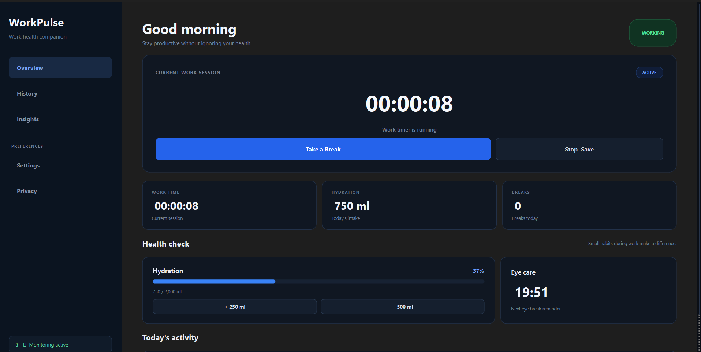
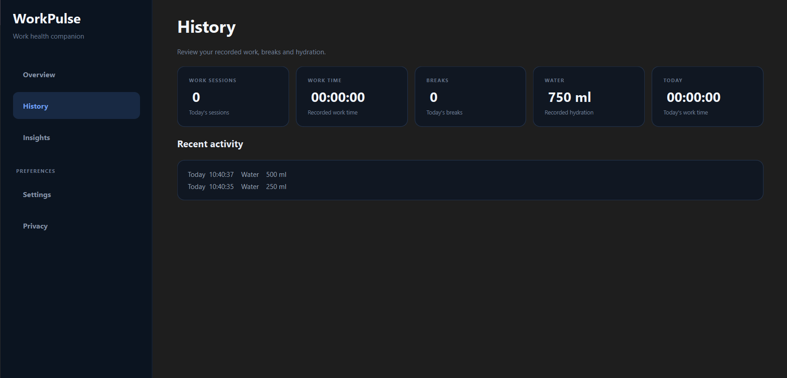
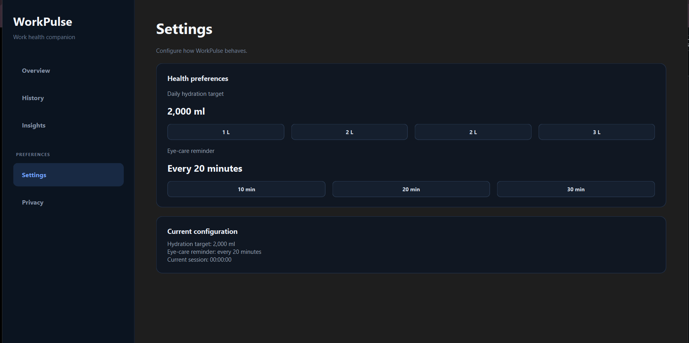

# WorkPulse

**WorkPulse** is a Windows desktop work-health tracker built with **Python and PySide6**.

It is designed for people who spend long hours working in front of a screen, especially professionals working in **SOC, NOC, cybersecurity, IT operations, technical support, software development, and corporate environments**.

The goal is simple: help users remember to take breaks, drink water, give their eyes some rest, and keep track of their work sessions without getting in the way of their work.

---

## Why WorkPulse?

Long shifts in a SOC, NOC, IT operations team, or corporate environment can involve several hours of continuous screen time.

During busy shifts, it is easy to forget:

- Drinking enough water
- Taking short breaks
- Giving your eyes a rest
- Tracking how long you have been working
- Taking care of basic work-health habits

WorkPulse provides simple desktop reminders and tracking features to help with these habits.

It is **not intended to replace medical advice or workplace health policies**. It is simply a practical productivity and work-health companion.

---

## Features

### Work Tracking

- Work session timer
- Start and stop work sessions
- Session duration tracking
- Daily work activity tracking
- Automatic idle detection
- Automatic timer pause/resume

### Break Tracking

- Break tracking
- Break activity history
- Desktop reminders
- Daily break information

### Hydration

- Record water intake
- Configurable daily water goal
- Track total water consumed
- Display daily hydration progress
- Store hydration history locally

### Eye Care

- Configurable eye-break interval
- Desktop eye-break reminders
- Countdown display
- Designed for long screen-based work sessions

### History

- Persistent activity history
- Work session history
- Break history
- Water intake history
- Today / Yesterday activity
- Recent activity display
- Daily work-health information

### Application

- Windows desktop GUI
- Dark-mode interface
- Local data storage
- Desktop notifications
- No cloud account required
- No remote database required for core functionality

---

# Screenshots

## Dashboard



The dashboard provides a quick view of work activity, water intake, eye-break status, and current work sessions.

## History



The History page allows users to review recorded work sessions, breaks, and hydration activity.

## Settings



Settings allow users to configure work-health related preferences such as water goals and eye-break intervals.

---

# Download for Windows

The easiest way to use WorkPulse is the Windows release.

## Option 1 — Windows Portable Version

Download the latest:

`WorkPulse-Windows.zip`

Then:

1. Download the ZIP file.
2. Extract the ZIP.
3. Open the extracted `WorkPulse` folder.
4. Run:

```text
WorkPulse.exe
